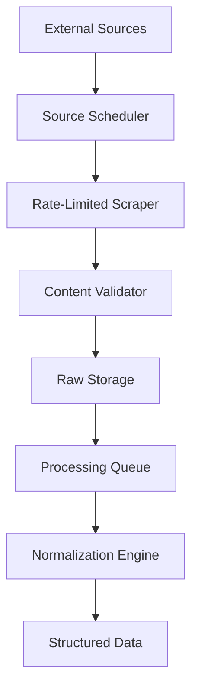
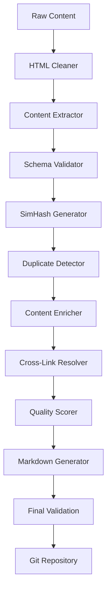
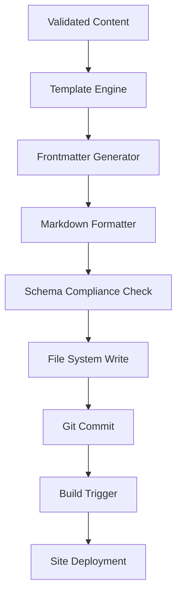

# AI Knowledge Website - System Architecture

## Executive Summary

This document outlines the comprehensive system architecture for the AI Knowledge Website project, designed to support automated content ingestion, processing, and publication at enterprise scale while maintaining high quality standards and compliance requirements.

## 1. High-Level Architecture

### System Overview

```text
┌─────────────────────────────────────────────────────────────────────────────┐
│                          AI Knowledge Website System                        │
├─────────────────────────────────────────────────────────────────────────────┤
│                                                                             │
│  ┌─────────────────┐    ┌─────────────────┐    ┌─────────────────┐        │
│  │   External      │    │   Content       │    │   Presentation  │        │
│  │   Sources       │───▶│   Pipeline      │───▶│   Layer         │        │
│  │                 │    │                 │    │                 │        │
│  └─────────────────┘    └─────────────────┘    └─────────────────┘        │
│                                                                             │
│  ┌─────────────────┐    ┌─────────────────┐    ┌─────────────────┐        │
│  │   Orchestration │    │   Data Storage  │    │   Quality       │        │
│  │   Engine        │    │   Layer         │    │   Assurance     │        │
│  │                 │    │                 │    │                 │        │
│  └─────────────────┘    └─────────────────┘    └─────────────────┘        │
│                                                                             │
└─────────────────────────────────────────────────────────────────────────────┘
```

### Core Principles

1. **Event-Driven Architecture**: Async processing with workflow orchestration
2. **Domain-Driven Design**: Clear boundaries between content, presentation, and pipeline
3. **Microservices Pattern**: Independent, scalable components
4. **Data Integrity**: Strong schema validation and consistency checks
5. **Observability**: Comprehensive monitoring and tracing
6. **Security-First**: Zero-trust architecture with proper authorization

## 2. Component Architecture

### 2.1 Presentation Layer

**Technology Stack**: Astro + TypeScript + Tailwind CSS

```typescript
// Component Structure
apps/site/
├── src/
│   ├── components/          # Reusable UI components
│   │   ├── glossary/       # Glossary-specific components
│   │   ├── articles/       # Article-specific components
│   │   └── shared/         # Common UI components
│   ├── content/            # Content collections with Zod validation
│   │   ├── config.ts       # Schema definitions
│   │   ├── glossary/       # Markdown files
│   │   ├── articles/       # MDX files
│   │   └── taxonomies/     # Controlled vocabularies
│   ├── layouts/            # Page layouts
│   ├── pages/              # Route definitions
│   └── utils/              # Utility functions
```

**Key Features**:

- Content Collections with Zod schema validation
- Static Site Generation (SSG) for performance
- Progressive enhancement for interactivity
- SEO optimization with structured data
- Accessibility compliance (WCAG 2.1 AA)

### 2.2 Content Pipeline

**Technology Stack**: Python + LangGraph + FastAPI + Celery

```python
# Pipeline Architecture
pipelines/
├── ingest/                 # External source ingestion
│   ├── scrapers/          # Source-specific scrapers
│   ├── apis/              # API integrations
│   ├── feeds/             # RSS/Atom feed processors
│   └── sources.yaml       # Source configurations
├── normalize/             # Data normalization
│   ├── extractors/        # Content extractors
│   ├── cleaners/          # Data cleaning
│   └── validators/        # Schema validation
├── dedup/                 # Duplicate detection
│   ├── simhash/           # SimHash implementation
│   ├── lsh/               # Locality-Sensitive Hashing
│   └── clustering/        # Content clustering
├── enrich/                # Content enrichment
│   ├── taxonomy/          # Auto-tagging
│   ├── linking/           # Cross-reference detection
│   └── quality/           # Quality scoring
└── publish/               # Markdown generation
    ├── templates/         # Content templates
    ├── formatters/        # Output formatters
    └── validators/        # Final validation
```

**Pipeline Stages**:

1. **Ingest**: Ethical web scraping with rate limiting and robots.txt compliance
2. **Normalize**: Clean HTML, extract structured data, validate schemas
3. **Dedup**: SimHash + MinHash LSH for near-duplicate detection (<2% false positives)
4. **Enrich**: Auto-tagging, cross-linking, quality scoring
5. **Publish**: Generate validated Markdown with proper frontmatter

### 2.3 Orchestration Engine

**Technology Stack**: LangGraph + Redis + PostgreSQL

```python
# LangGraph Workflow Definition
from langgraph import StateGraph, END

class ContentPipelineState(TypedDict):
    sources: List[SourceConfig]
    raw_content: List[RawContent]
    normalized_content: List[NormalizedContent]
    deduplicated_content: List[UniqueContent]
    enriched_content: List[EnrichedContent]
    published_files: List[PublishedFile]
    errors: List[ProcessingError]
    metadata: Dict[str, Any]

workflow = StateGraph(ContentPipelineState)
workflow.add_node("ingest", ingest_node)
workflow.add_node("normalize", normalize_node)
workflow.add_node("dedup", dedup_node)
workflow.add_node("enrich", enrich_node)
workflow.add_node("publish", publish_node)
workflow.add_node("quality_check", quality_check_node)

# Define flow
workflow.set_entry_point("ingest")
workflow.add_edge("ingest", "normalize")
workflow.add_edge("normalize", "dedup")
workflow.add_edge("dedup", "enrich")
workflow.add_edge("enrich", "publish")
workflow.add_edge("publish", "quality_check")
workflow.add_edge("quality_check", END)
```

### 2.4 Data Storage Layer

**Storage Strategy**:

```yaml
# Multi-tier Storage Architecture
Primary Storage:
  - Git Repository: Version-controlled Markdown files
  - File System: Structured content hierarchy

Operational Storage:
  - PostgreSQL: Metadata, relationships, processing state
  - Redis: Caching, job queues, session state
  - Object Storage: Raw content snapshots, backups

Search & Analytics:
  - Elasticsearch: Full-text search, analytics
  - Vector Database: Semantic similarity, embeddings
```

**Database Schema**:

```sql
-- Core Tables
CREATE TABLE sources (
    id SERIAL PRIMARY KEY,
    name VARCHAR(255) UNIQUE NOT NULL,
    url TEXT NOT NULL,
    type VARCHAR(50) NOT NULL,
    config JSONB,
    last_crawled TIMESTAMP,
    status VARCHAR(50) DEFAULT 'active'
);

CREATE TABLE content_items (
    id SERIAL PRIMARY KEY,
    source_id INTEGER REFERENCES sources(id),
    original_url TEXT NOT NULL,
    title TEXT NOT NULL,
    content_hash VARCHAR(64) UNIQUE,
    simhash BIGINT,
    status VARCHAR(50) DEFAULT 'processing',
    metadata JSONB,
    created_at TIMESTAMP DEFAULT NOW(),
    updated_at TIMESTAMP DEFAULT NOW()
);

CREATE TABLE duplicates (
    id SERIAL PRIMARY KEY,
    primary_item_id INTEGER REFERENCES content_items(id),
    duplicate_item_id INTEGER REFERENCES content_items(id),
    similarity_score FLOAT,
    detection_method VARCHAR(50),
    created_at TIMESTAMP DEFAULT NOW()
);

-- Indexes for performance
CREATE INDEX idx_content_simhash ON content_items(simhash);
CREATE INDEX idx_content_hash ON content_items(content_hash);
CREATE INDEX idx_duplicates_similarity ON duplicates(similarity_score DESC);
```

## 3. Data Flow Architecture

### 3.1 Content Ingestion Flow



### 3.2 Processing Pipeline Flow



### 3.3 Publication Flow



## 4. Integration Patterns

### 4.1 Event-Driven Communication

**Message Bus Architecture**:

```python
# Event Schema
from pydantic import BaseModel
from datetime import datetime
from typing import Dict, Any, Optional

class PipelineEvent(BaseModel):
    event_id: str
    event_type: str
    source: str
    timestamp: datetime
    data: Dict[str, Any]
    metadata: Optional[Dict[str, Any]] = None

# Event Types
EVENT_TYPES = {
    "content.ingested": ContentIngestedEvent,
    "content.normalized": ContentNormalizedEvent,
    "content.deduplicated": ContentDeduplicatedEvent,
    "content.enriched": ContentEnrichedEvent,
    "content.published": ContentPublishedEvent,
    "pipeline.failed": PipelineFailedEvent,
    "quality.check_failed": QualityCheckFailedEvent
}

# Event Handlers
async def handle_content_ingested(event: ContentIngestedEvent):
    await normalize_queue.enqueue(event.data)

async def handle_content_published(event: ContentPublishedEvent):
    await trigger_build()
    await update_search_index()
```

### 4.2 API Gateway Pattern

```python
# FastAPI Gateway
from fastapi import FastAPI, Depends, HTTPException
from fastapi.security import HTTPBearer

app = FastAPI(title="AI Knowledge API Gateway")
security = HTTPBearer()

@app.post("/api/v1/ingest")
async def trigger_ingestion(
    source_ids: List[str],
    token: str = Depends(security)
):
    # Authenticate and authorize
    # Queue ingestion jobs
    # Return job tracking info
    pass

@app.get("/api/v1/pipeline/status/{job_id}")
async def get_pipeline_status(job_id: str):
    # Return pipeline execution status
    pass

@app.post("/api/v1/content/validate")
async def validate_content(content: ContentItem):
    # Validate against schemas
    # Return validation results
    pass
```

### 4.3 Circuit Breaker Pattern

```python
# External Source Protection
import asyncio
from datetime import datetime, timedelta

class CircuitBreaker:
    def __init__(self, failure_threshold=5, recovery_timeout=60):
        self.failure_threshold = failure_threshold
        self.recovery_timeout = recovery_timeout
        self.failure_count = 0
        self.last_failure_time = None
        self.state = "CLOSED"  # CLOSED, OPEN, HALF_OPEN

    async def call(self, func, *args, **kwargs):
        if self.state == "OPEN":
            if self._should_attempt_reset():
                self.state = "HALF_OPEN"
            else:
                raise Exception("Circuit breaker is OPEN")

        try:
            result = await func(*args, **kwargs)
            self._on_success()
            return result
        except Exception as e:
            self._on_failure()
            raise e
```

## 5. Scalability Design

### 5.1 Horizontal Scaling Strategy

**Component Scaling**:

```yaml
# Kubernetes Deployment Configuration
apiVersion: apps/v1
kind: Deployment
metadata:
  name: content-pipeline
spec:
  replicas: 3
  selector:
    matchLabels:
      app: content-pipeline
  template:
    metadata:
      labels:
        app: content-pipeline
    spec:
      containers:
      - name: pipeline
        image: ai-knowledge/pipeline:latest
        resources:
          requests:
            cpu: 100m
            memory: 256Mi
          limits:
            cpu: 500m
            memory: 1Gi
        env:
        - name: REDIS_URL
          value: "redis://redis:6379"
        - name: DATABASE_URL
          valueFrom:
            secretKeyRef:
              name: db-secret
              key: url
```

**Auto-scaling Configuration**:

```yaml
apiVersion: autoscaling/v2
kind: HorizontalPodAutoscaler
metadata:
  name: pipeline-hpa
spec:
  scaleTargetRef:
    apiVersion: apps/v1
    kind: Deployment
    name: content-pipeline
  minReplicas: 2
  maxReplicas: 10
  metrics:
  - type: Resource
    resource:
      name: cpu
      target:
        type: Utilization
        averageUtilization: 70
  - type: Resource
    resource:
      name: memory
      target:
        type: Utilization
        averageUtilization: 80
```

### 5.2 Database Scaling

**Read Replicas and Partitioning**:

```sql
-- Horizontal partitioning by date
CREATE TABLE content_items_y2024m01 PARTITION OF content_items
FOR VALUES FROM ('2024-01-01') TO ('2024-02-01');

CREATE TABLE content_items_y2024m02 PARTITION OF content_items
FOR VALUES FROM ('2024-02-01') TO ('2024-03-01');

-- Read replica configuration
CREATE PUBLICATION content_pub FOR TABLE content_items, sources;
-- On replica: CREATE SUBSCRIPTION content_sub CONNECTION 'host=primary' PUBLICATION content_pub;
```

### 5.3 Caching Strategy

```python
# Multi-layer Caching
from redis import Redis
import hashlib
import json

class CacheManager:
    def __init__(self):
        self.redis = Redis(host='redis', port=6379, decode_responses=True)
        self.local_cache = {}

    async def get_or_set(self, key: str, fetch_func, ttl: int = 3600):
        # L1: Local cache
        if key in self.local_cache:
            return self.local_cache[key]

        # L2: Redis cache
        cached = self.redis.get(key)
        if cached:
            value = json.loads(cached)
            self.local_cache[key] = value
            return value

        # L3: Database/API
        value = await fetch_func()
        self.redis.setex(key, ttl, json.dumps(value))
        self.local_cache[key] = value
        return value
```

## 6. Security Architecture

### 6.1 Zero-Trust Architecture

**Security Layers**:

```python
# Authentication & Authorization
from fastapi import Depends, HTTPException, status
from fastapi.security import HTTPBearer
import jwt

class SecurityManager:
    def __init__(self, secret_key: str):
        self.secret_key = secret_key

    def verify_token(self, token: str) -> dict:
        try:
            payload = jwt.decode(token, self.secret_key, algorithms=["HS256"])
            return payload
        except jwt.ExpiredSignatureError:
            raise HTTPException(
                status_code=status.HTTP_401_UNAUTHORIZED,
                detail="Token has expired"
            )
        except jwt.JWTError:
            raise HTTPException(
                status_code=status.HTTP_401_UNAUTHORIZED,
                detail="Could not validate credentials"
            )

    def check_permissions(self, user: dict, resource: str, action: str) -> bool:
        # Role-based access control
        user_roles = user.get("roles", [])
        required_permission = f"{resource}:{action}"
        return any(
            required_permission in role.get("permissions", [])
            for role in user_roles
        )
```

### 6.2 Data Protection

**Encryption and Sanitization**:

```python
# Sensitive Data Handling
import bcrypt
from cryptography.fernet import Fernet
import re

class DataProtection:
    def __init__(self, encryption_key: bytes):
        self.fernet = Fernet(encryption_key)

    def encrypt_sensitive(self, data: str) -> str:
        """Encrypt sensitive configuration data"""
        return self.fernet.encrypt(data.encode()).decode()

    def decrypt_sensitive(self, encrypted_data: str) -> str:
        """Decrypt sensitive configuration data"""
        return self.fernet.decrypt(encrypted_data.encode()).decode()

    def sanitize_content(self, content: str) -> str:
        """Remove potentially malicious content"""
        # Remove script tags
        content = re.sub(r'<script.*?>.*?</script>', '', content, flags=re.DOTALL)
        # Remove inline JavaScript
        content = re.sub(r'on\w+="[^"]*"', '', content)
        # Remove data URLs
        content = re.sub(r'data:[^"]*', '', content)
        return content
```

### 6.3 API Security

```python
# Rate Limiting and Input Validation
from slowapi import Limiter, _rate_limit_exceeded_handler
from slowapi.util import get_remote_address
from slowapi.errors import RateLimitExceeded

limiter = Limiter(key_func=get_remote_address)

@app.middleware("http")
async def security_headers(request, call_next):
    response = await call_next(request)
    response.headers["X-Content-Type-Options"] = "nosniff"
    response.headers["X-Frame-Options"] = "DENY"
    response.headers["X-XSS-Protection"] = "1; mode=block"
    response.headers["Strict-Transport-Security"] = "max-age=31536000; includeSubDomains"
    return response

@app.post("/api/v1/ingest")
@limiter.limit("10/minute")
async def trigger_ingestion(request: Request, data: IngestRequest):
    # Input validation and sanitization
    validated_data = validate_and_sanitize(data)
    # Process request
    pass
```

## 7. Technology Stack Recommendations

### 7.1 Frontend Stack

```typescript
// Primary Technologies
{
  "framework": "Astro",
  "version": "^4.0.0",
  "typescript": "^5.0.0",
  "styling": "Tailwind CSS",
  "validation": "Zod",
  "markdown": "MDX",
  "search": "Pagefind",
  "analytics": "Plausible"
}

// Component Libraries
{
  "ui": "@headlessui/react",
  "icons": "Lucide React",
  "forms": "React Hook Form",
  "charts": "Chart.js"
}
```

### 7.2 Backend Stack

```python
# Pipeline Technologies
{
    "orchestration": "langgraph>=0.2.0",
    "web_framework": "fastapi>=0.104.0",
    "async_tasks": "celery>=5.3.0",
    "database": "postgresql>=14",
    "cache": "redis>=7.0",
    "validation": "pydantic>=2.0.0",
    "scraping": "playwright>=1.40.0",
    "deduplication": "datasketch>=1.6.0",
    "nlp": "spacy>=3.7.0",
    "similarity": "sentence-transformers>=2.2.0"
}

# Quality & Testing
{
    "testing": "pytest>=7.4.0",
    "coverage": "pytest-cov>=4.1.0",
    "linting": "ruff>=0.1.0",
    "type_checking": "mypy>=1.7.0",
    "security": "bandit>=1.7.0"
}
```

### 7.3 Infrastructure Stack

```yaml
# Container & Orchestration
Container: Docker
Orchestration: Kubernetes
Service Mesh: Istio (optional)

# Monitoring & Observability
Metrics: Prometheus + Grafana
Logging: Fluentd + Elasticsearch + Kibana
Tracing: Jaeger
APM: New Relic or DataDog

# CI/CD
Source Control: GitHub
CI/CD: GitHub Actions
Registry: GitHub Container Registry
Deployment: ArgoCD or Flux

# Cloud Services
Compute: Google Cloud Run / AWS ECS
Database: Google Cloud SQL / AWS RDS
Storage: Google Cloud Storage / AWS S3
CDN: Cloudflare
DNS: Cloudflare DNS
```

## 8. Deployment Architecture

### 8.1 Multi-Environment Strategy

```yaml
# Environment Configuration
environments:
  development:
    replicas: 1
    resources:
      cpu: "100m"
      memory: "256Mi"
    database: "postgresql-dev"
    cache: "redis-dev"
    
  staging:
    replicas: 2
    resources:
      cpu: "250m"
      memory: "512Mi"
    database: "postgresql-staging"
    cache: "redis-staging"
    
  production:
    replicas: 5
    resources:
      cpu: "500m"
      memory: "1Gi"
    database: "postgresql-prod"
    cache: "redis-prod-cluster"
    autoscaling:
      min: 3
      max: 20
      cpu_target: 70
      memory_target: 80
```

### 8.2 GitOps Deployment Pipeline

```yaml
# .github/workflows/deploy.yml
name: Deploy Pipeline
on:
  push:
    branches: [main]
  pull_request:
    branches: [main]

jobs:
  test:
    runs-on: ubuntu-latest
    steps:
      - uses: actions/checkout@v4
      - name: Setup Python
        uses: actions/setup-python@v4
        with:
          python-version: '3.11'
      - name: Install dependencies
        run: |
          make install
      - name: Run tests
        run: |
          make test
      - name: Quality checks
        run: |
          npm run build
          npm run lint
          python scripts/link_check.py
          python scripts/dedup_check.py

  deploy-staging:
    needs: test
    if: github.ref == 'refs/heads/main'
    runs-on: ubuntu-latest
    steps:
      - name: Deploy to staging
        run: |
          kubectl apply -f k8s/staging/
          kubectl rollout status deployment/content-pipeline -n staging

  deploy-production:
    needs: [test, deploy-staging]
    if: github.ref == 'refs/heads/main'
    runs-on: ubuntu-latest
    environment: production
    steps:
      - name: Deploy to production
        run: |
          kubectl apply -f k8s/production/
          kubectl rollout status deployment/content-pipeline -n production
```

### 8.3 Monitoring and Alerting

```yaml
# Prometheus Alert Rules
groups:
  - name: ai-knowledge-alerts
    rules:
      - alert: HighErrorRate
        expr: rate(http_requests_total{status=~"5.."}[5m]) > 0.1
        for: 5m
        labels:
          severity: critical
        annotations:
          summary: "High error rate detected"
          
      - alert: PipelineFailure
        expr: pipeline_jobs_failed_total > 0
        for: 1m
        labels:
          severity: warning
        annotations:
          summary: "Pipeline job failed"
          
      - alert: DuplicateDetectionFailure
        expr: duplicate_detection_accuracy < 0.98
        for: 10m
        labels:
          severity: critical
        annotations:
          summary: "Duplicate detection accuracy below threshold"
```

## 9. Implementation Roadmap

### Phase 1: Foundation (Weeks 1-4)

- Set up development environment and toolchain
- Implement core Zod schemas and content validation
- Create basic Astro site structure with content collections
- Implement PostgreSQL schema and basic CRUD operations
- Set up CI/CD pipeline with quality gates

### Phase 2: Content Pipeline (Weeks 5-8)

- Implement ingest module with ethical scraping
- Create normalize module with HTML cleaning and extraction
- Develop SimHash-based duplicate detection with LSH
- Build LangGraph orchestration workflows
- Implement basic content enrichment (tagging, linking)

### Phase 3: Quality & Security (Weeks 9-12)

- Implement comprehensive test suite
- Add security measures (authentication, rate limiting, input validation)
- Create monitoring and alerting infrastructure
- Implement advanced quality scoring and validation
- Add performance optimization and caching

### Phase 4: Production Readiness (Weeks 13-16)

- Deploy to staging environment
- Conduct load testing and performance tuning
- Implement backup and disaster recovery
- Complete security audit and penetration testing
- Deploy to production with full monitoring

## 10. Success Metrics and KPIs

### Performance Metrics

- **Duplicate Detection Accuracy**: >98% precision, <2% false positives
- **Pipeline Processing Time**: <30 minutes for full content refresh
- **Site Build Time**: <5 minutes for incremental builds
- **API Response Time**: <200ms for 95th percentile
- **Uptime**: >99.9% availability

### Quality Metrics

- **Content Coverage**: >95% of ingested content successfully processed
- **Schema Compliance**: 100% of published content passes validation
- **Link Integrity**: <1% broken links across all content
- **Source Attribution**: 100% of content includes proper licensing
- **Cross-Reference Accuracy**: >90% of auto-generated links are relevant

### Operational Metrics

- **Build Success Rate**: >98% of deployments succeed
- **Security Incidents**: 0 critical security vulnerabilities
- **Recovery Time**: <30 minutes for system restoration
- **Cost Efficiency**: Infrastructure costs scale linearly with content volume

---

This architecture provides a robust, scalable, and maintainable foundation for the AI Knowledge Website project, supporting enterprise-grade requirements while remaining practical to implement and operate.
